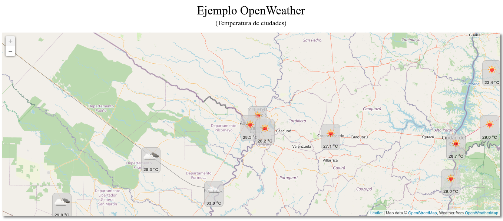
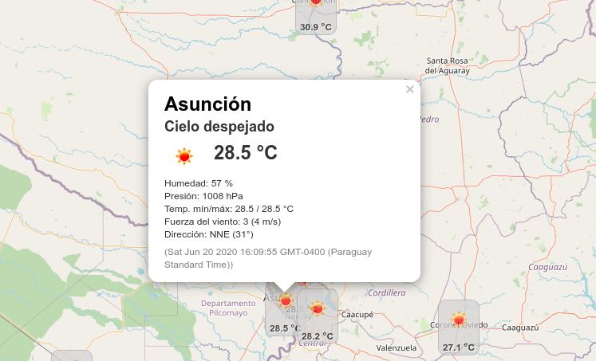

# Live coding 4 - OpenWeather
Ejemplo de PI OpenWeather https://openweathermap.org

## Descripción
Es un ejemplo utilizando el servicio de OpenWeather para ver la termeratura de las ciudades del mundo.
Para poder utilizar el servicio se tiene que crear una cuenta en https://openweathermap.org para obtener un API KEY.

## Screenhots

## Herramientas de desarrollo
* Librería de mapas: [Leftlet](https://leafletjs.com/)
* Lenguajes de programación: HTML, CSS y JavaScript

## Documentaciones útiles
* https://openweathermap.org/
* https://openweathermap.org/api
* https://openweathermap.org/weathermap?basemap=map&cities=true&layer=temperature&lat=-25.2871&lon=-57.5406&zoom=5
* https://leafletjs.com/
* https://github.com/buche/leaflet-openweathermap
